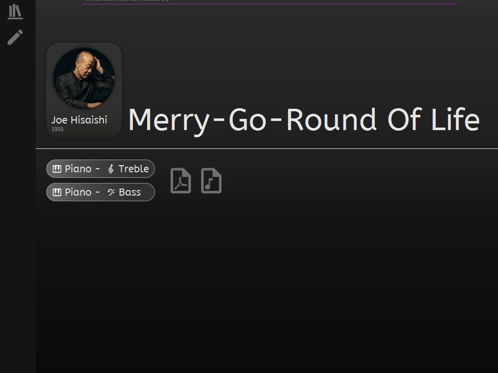
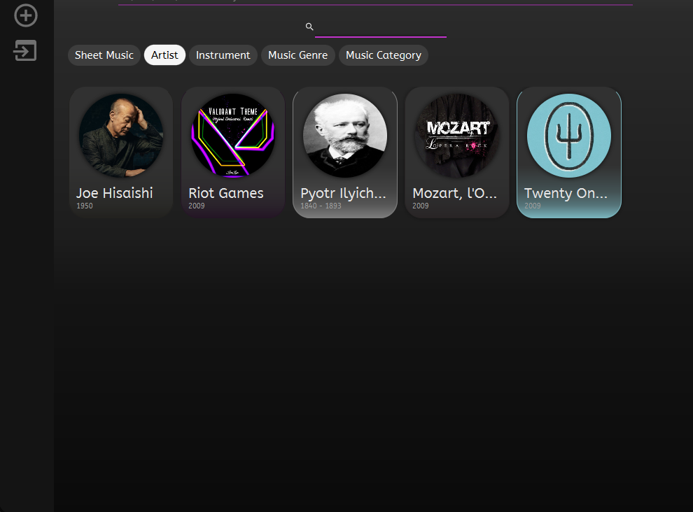

# Music Sheet Library

    
    

Instead of searching for music sheets in your file folder, creates a visual interface for all your music sheets, with customizable metadata such as, but not limited to :

- Artist
- Instrument
- Genre
- Category (Video Game, Movie, ...)

Search for music sheets pdfs can be made using these metadata and music sheets can be linked to Musescore files

You can import a new sheet music simply by drag and drop either a pdf file or a mscz Musescore file

